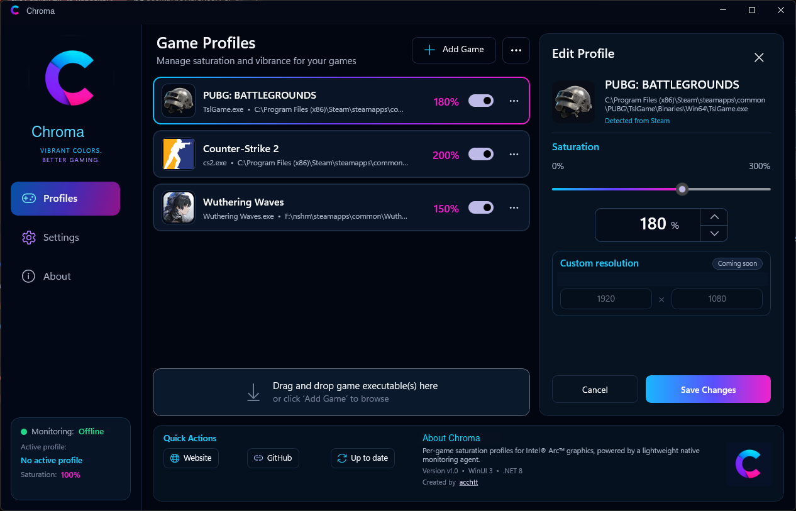

# Chroma

**Automatic per-game saturation profiles for Intel, NVIDIA, and AMD graphics.**

Chroma is a lightweight Windows utility that detects the active game, applies its saved saturation profile through a native GPU color backend, and restores the desktop color state when the game closes.

> Current release: **v1.10**

[Visit the Chroma website](https://acchtt.github.io/Chroma/)

<p align="center">
  
</p>

## Features

- Per-game saturation profiles from 0% to 300%
- Automatic profile activation based on the foreground game executable
- Automatic restoration of desktop color settings
- Native color backends for Intel IGCL, NVIDIA NVAPI, and AMD ADLX
- GPU backend selector with Automatic, Intel, NVIDIA, and AMD choices
- Automatic mode prioritizes the GPU driving the primary Windows display
- Lightweight native monitoring agent and system-tray operation
- Primary-display GPU information in the monitoring card
- Steam game detection and executable icon extraction
- Windows startup support
- Update checks on every launch and tray/second-launch reopen
- Visible updater progress for download, checksum verification, preparation, and restart
- Automatic removal of old update packages, staging folders, and backups after installation
- Updates replace the exact folder containing the launched `Chroma.exe`
- SHA-256 verification, rollback protection, staged-file cleanup, and automatic restart
- Light and dark WinUI 3 interface

## GPU support

- **Intel:** IGCL backend; verified on Intel Arc hardware
- **NVIDIA:** NVAPI Digital Vibrance backend; implemented and awaiting broader hardware validation
- **AMD:** ADLX custom-color backend; implemented and awaiting broader hardware validation

The backend used depends on the GPU and display path available to Windows. Hybrid-GPU laptops and unusual monitor-routing configurations may behave differently from desktop systems.

## Requirements

- Windows 10 or Windows 11, 64-bit
- A supported Intel, NVIDIA, or AMD graphics adapter
- A current graphics driver for the installed GPU

AMD support is compiled when the ADLX SDK checkout is available under `third_party/ADLX`. Intel and NVIDIA support build without bundling vendor runtime DLLs.

## Download

Download the validated Windows x64 build from
[GitHub Releases](https://github.com/acchtt/Chroma/releases).

## Repository layout

- [`Chroma.WinUI/`](Chroma.WinUI/) — .NET 8 / WinUI 3 desktop interface
- [`NativeAgent/`](NativeAgent/) — native C++ monitoring and GPU color-control agent
- [`NativeAgent/tests/`](NativeAgent/tests/) — native profile-matching tests
- [`third_party/`](third_party/) — instructions for local vendor SDK checkouts
- [`website/`](website/) — dependency-free GitHub Pages website
- [`build.ps1`](build.ps1) — validated Windows x64 build and publish script
- [`clean.ps1`](clean.ps1) — safe local build-output and backup cleanup
- [`.github/workflows/`](.github/workflows/) — automated Windows release builds

## Building from source

Recommended build environment:

- Visual Studio 2022
- Desktop development with C++ workload
- .NET 8 SDK
- Windows App SDK / WinUI 3 tooling
- CMake

To include the AMD backend, clone the official ADLX SDK into the expected folder and check out the same revision used by release builds:

```powershell
git clone https://github.com/GPUOpen-LibrariesAndSDKs/ADLX.git "third_party\ADLX"
git -C "third_party\ADLX" checkout d9f04a9bba022d6cf6333f005dd540b4ad19fb63
```

Build Chroma from PowerShell:

```powershell
./build.ps1 -Configuration Release -Platform x64 -SelfContained
```

The build output is written to `dist/x64/`. The solution can also be opened directly from `Chroma.sln`.

GitHub Actions runs the same Release x64 build, checks out the pinned ADLX SDK revision, and uploads a packaged Windows artifact for validation. Release builds use the version in `Chroma.WinUI.csproj`, publish a matching versioned ZIP, and include a SHA-256 checksum beside the download. The portable package contains only `Chroma.exe` and `Chroma.Agent.exe`; application artwork and vendor integration code are embedded in the executables.

## Cleaning local outputs

Remove generated build directories, IDE output, logs, and temporary backup files while preserving local vendor SDK checkouts:

```powershell
./clean.ps1
```

Preview the cleanup without deleting anything:

```powershell
./clean.ps1 -WhatIf
```

Remove vendor SDK checkouts as well:

```powershell
./clean.ps1 -VendorSdks
```

## Reporting issues

Please include your Windows version, GPU vendor and model, graphics-driver version, monitor connection, affected game, reproduction steps, and relevant Chroma logs.

## Licensing

Chroma-authored source code is licensed under the [MIT License](LICENSE).

The **Chroma** name, logo, icon, and visual brand assets are covered by the separate [brand usage notice](BRAND_USAGE.md).

Third-party GPU API materials retain their original copyright and license terms. See [third-party notices](THIRD_PARTY_NOTICES.md).

## Disclaimer

Chroma is an independent project and is not affiliated with, endorsed by, or sponsored by Intel, NVIDIA, or AMD. Product and company names are trademarks of their respective owners.
